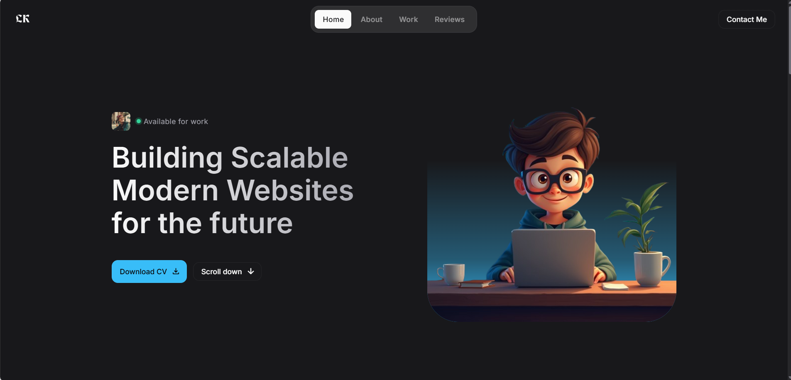
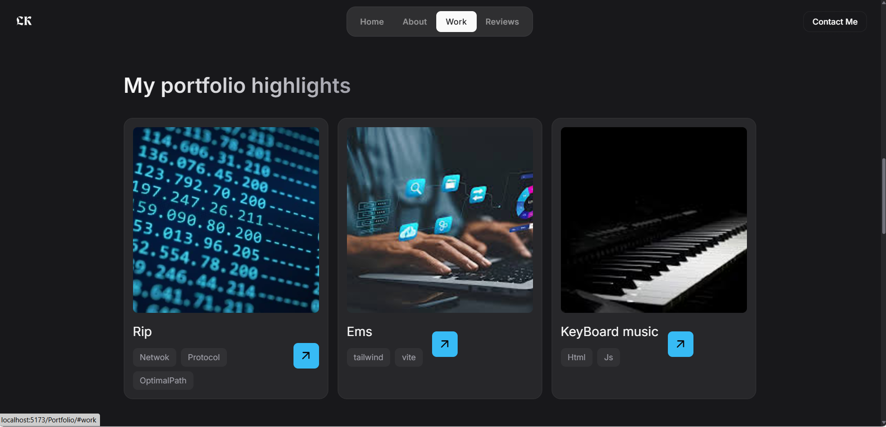
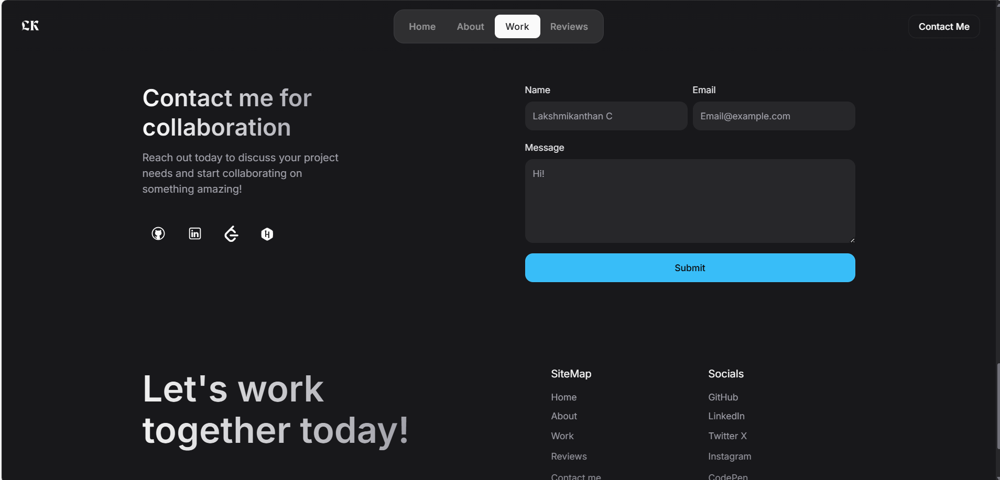

# 👨‍💻Personal PortFolio

"Welcome to my personal portfolio👨‍💻, a space where creativity🎨 and professionalism converge to tell the story of my journey. This portfolio is a testament to my dedication, showcasing the skills, projects, and experiences that define who I am as a designer, developer, and innovator.<a href="https://rb.gy/zm5qn5">Live Demo</a>

## 📌Techstack
 &nbsp;  &nbsp;  &nbsp;  &nbsp; &nbsp;

## 📌Screenshots











## 📌Demo

https://github.com/user-attachments/assets/9323068d-0665-4894-b4bf-608a288f530f

**Check out the website here ➡️** (https://lakshmikanthanc.github.io/Portfolio/)

## 📌Installation

Follow the below steps to run the application,

**Step 1:** Run this command in your terminal to make a clone

```
gh repo clone PortFolio/lak
```
or 
Download the ZIP file

**Step 2:** Change the path to
```
cd lak
```
**Step 3:** Vite Installation
```
npm install vite
```
**Step 4:** 
```
npm run dev
```

![GitHubViews]https://github.com/LakshmikanthanC/Portfolio
